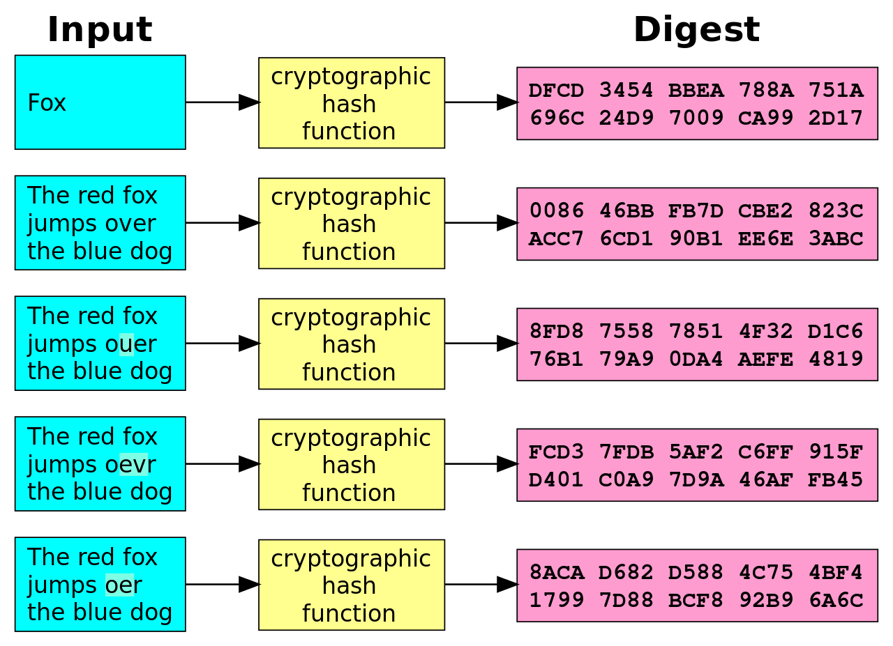

<small>["Pyroclastic fireball" by Duke](<https://www.shadertoy.com/view/MtXSzS>)</small>

&nbsp;

## 도입

오늘은 shader 에서 가장 기본이 되는 것들 중 하나인 fire shader 를 살펴보려고 합니다. 여기서 `random`, `noise`, `fbm`, `bumpMap` 등 shader 의 기초적인 구성요소들을 하나씩 짚어보면서 Shadertoy 에 사용된 fragment shader 에서 이것들을 어떻게 표현할 수 있는지를 알아볼 것입니다.

이번에 분석할 Shadertoy 의 코드는 많은 fire 관련 shader 중에서 단순한 편에 속하면서도 필요한 내용을 빼곡하게 담고 있는 [Fire Shader](<https://www.shadertoy.com/view/MdKfDh>)입니다. 이 코드를 처음 봤을 때 마치 누군가 저를 위해 예제코드를 써준 것 같아서 너무 행복했습니다. 그럼 시작해보겠습니다.

&nbsp;
## random

대부분의 프로그래밍 언어에서 랜덤 함수는 간단한 형태로 불러와서 즉시 사용할 수 있습니다. javascript 에서는 `Math.random()` 이 0.0 이상 1.0 미만의 값을 반환합니다. python 에서는 `import random` 으로 random 라이브러리를 불러온 다음에 `random.random()` 으로 같은 일을 할 수 있습니다.

shader 에는 이렇게 간편하게 쓸 수 있는 함수가 없습니다. 대신 2가지 선택지가 있는데요. 하나는 랜덤한 값(주로 흑과 백의 noise)이 칠해져 있는 image 를 불러오는 것과, 직접 랜덤함수를 만들어서 쓰는 것입니다.

<small>Shadertoy 에서 기본적으로 제공하는 noise 이미지들. 코드 하단의 iChannel0~4 를 누르고 Texture 를 선택하면 나옵니다. 이에 대한 설명은 다른 글에서 다루겠습니다.</small>

오늘은 직접 랜덤함수를 만들어서 쓰는 방법을 알아보겠습니다. [The book of shaders 의 이 글](<https://thebookofshaders.com/10/>)과 [이 코드와 동영상](<http://www.shaderslab.com/demo-62---pseudo-random.html>) 등에 이미 좋은 설명들이 자세하게 나와 있습니다만, 그래도 좀 더 자세히, 가급적이면 쉽게 설명해보려고 합니다.

랜덤한 수, 한자어로 난수란 *주기성을 갖지 않는, 예측할 수 없는 수* 를 말합니다. 여기서 주기성이란 같은 수가 반복되는 성질입니다. 다음의 수열을 한번 살펴보겠습니다.

`1, 2, 3, 4, 5, 4, 3, 2, 1, 2, 3, 4, 5, 4, 3, 2, 1, 2, 3, 4, ...`

여기서 1은 1번째, 9번째, 16번째에 나오고 있습니다. 이 수열이 계속 이어진다고 했을 때 다음에는 16에 7을 더한 23번째에 1이 나올 것이라고 예측할 수 있습니다. 그리고 1~5 까지의 숫자들은 반복되며 계속 등장하고 있습니다. 즉 이 수열은 주기성도 갖고 예측할 수도 있기 때문에 랜덤이 아닙니다. 이런 수로 암호를 만들면 상대방에게 즉시 간파당할 것이고, 유니크 아이템 드랍 테이블을 만들면 대부분의 유저가 유니크 아이템을 얻어서 게임 내 밸런스는 붕괴될 것입니다.

그럼 이런 수열은 어떨까요?

`1, ?, ?, ?, ?, ?, ?, ?, 1, ?, ?, ?, ?, ?, ?, ?, 1, ?, ?, ?, ...`

여기서 ? 로 표시한 수는 예측이 불가능한 수입니다. 이런 수를 만들어낼 수 있다면 좋겠지만, 여전히 1번째, 9번째, 16번째, ... 에 오는 **1** 은 예측 가능합니다. 그렇다면 1이 나오는 주기가 늘어난다면 어떨까요?

`1, ?, ?, ...(매우 많은 수의 ?), ?, ?, 1, ?, ?, ..., ?, ?, 1, ?, ?, ...`

아직 주기성은 가지고 있지만, 나머지 숫자는 거의 ? 이기 때문에 예측이 거의 불가능한 수열이 될 것입니다. 이것이 바로 컴퓨터에서 보편적으로 사용하는 난수 생성기(Random Number Generator)입니다. 컴퓨터는 수식으로 난수를 만들기 때문에 주기성을 갖는 것은 어쩔 수 없지만, 그 주기를 최대한 늘려서 예측이 거의 불가능한 난수를 만들어냅니다.

<small>PHP 의 내장함수가 만든 랜덤(왼쪽)과 [Random.org](<https://www.random.org/>) 에서 생성한 랜덤의 비교. 왼쪽에서 패턴(주기성)이 보이는 것을 확인할 수 있습니다. 오른쪽이 만든 랜덤의 품질이 상대적으로 더 좋다는 것을 알 수 있습니다. [출처 링크](<https://boallen.com/random-numbers.html>)</small>

그럼 이제 shader 에서 어떻게 랜덤 함수(난수 생성기)를 만드는지에 대해서 코드와 함께 알아보겠습니다.

    a = 12.9898
    <input id='range_a' type='range' min='0.0' max='25.0' step='0.0001' value='12.9898' class='slider'>
     
    b = 78.233
    <input id='range_b' type='range' min='0.0' max='150.0' step='0.001' value='78.233' class='slider'>
     
    c = 43758.5453
    <input id='range_c' type='range' min='0.0' max='100000.0' step='0.0001' value='43758.5453' class='slider'>

<textarea id='shader_text_0' width='400' height='400' style='display:none;'>
uniform float a;
uniform float b;
uniform float c;
float rand(vec2 co) {
  return fract(sin(dot(co.xy, vec2(a, b))) * c);
}
void main() {
    float x = rand(gl_FragCoord.xy);
    gl_FragColor = vec4(x, x, x, 1.0);
}</textarea>
<iframe id='shader_preview_0' class='previewOutside'>
</iframe>

이 함수, `float rand(vec2 co)` 의 기원은 아직 정확하게 밝혀진 바가 없습니다. [이와 관련된 논의](<https://stackoverflow.com/questions/12964279/whats-the-origin-of-this-glsl-rand-one-liner>)가 stack overflow 에 올라온 적이 있습니다만, 여기서도 정확한 기원을 밝히는 데에는 실패했습니다. 기원은 몰라도 지금은 shader 쪽에서 가장 유명하고 널리 쓰이는 함수중의 하나가 되어버렸습니다.

위의 range slider 를 변화시키면서 a, b, c 에 각기 다른 값을 세팅해보면, 그럴듯한 랜덤값이 나올 때도 있지만 아래 이미지처럼 규칙적인 값이 나올 때도 있습니다. 애초에 이 함수를 만든 사람이 `a=12.9898`, `b=78.233`, `c=43758.5453` 를 어떤 기준으로 정했는지도 알 수 없지만, 거의 대부분이 이 값을 고치지 않고 그대로 쓰고 있습니다. 우리도 이 값을 그대로 써도 될 것 같습니다.

<small>a=3.244, b=19.464, c=44569.8166 일 때 입니다. 이 밖에도 a,b,c 를 각각 0으로 세팅하거나 다른 값으로 세팅할 때 가끔 품질이 나쁜 랜덤이 생성되는 것을 확인할 수 있습니다.</small>

이 함수는 2D 이미지의 각 픽셀에 대해서 간단하게 `0.0~1.0` 사이의 랜덤값을 만들어줍니다. 8행에서 `uv` 를 사용하는 대신 `gl_FragCoord` 만 사용해서 랜덤값을 계산한 것을 확인할 수 있습니다. `float rand(vec2 co)` 함수는 `co` 자리에 변수를 넣으면 랜덤값을 계산해줍니다. 물론 이 랜덤값은 수식으로 계산되었기 때문에 예측가능하지만 주기가 긴 유사랜덤값이라는 것을 앞에서도 말씀드렸습니다.

`dot` 는 dot product, 내적이라는 의미로 각 구성요소들을 서로 곱한 후 더해준다는 의미입니다. 예를 들어서 `gl_FragCoord.xy` 와 `vec2(a,b)` 를 `dot` 연산한다면, `gl_FragCoord.x * a + gl_FragCoord.y * b` 와 같은 값이 됩니다. `dot` 연산의 결과값은 언제나 `float` 이 됩니다.

`sin` 은 우리가 이 시리즈에서 계속 만나고 있는 삼각함수의 `sin` 입니다. [Shadertoy 메타볼 분석](<https://greentec.github.io/shadertoy-metaball/>)에서는 각 메타볼의 중심 좌표를 변하게 하기 위해서 `sin` 이 쓰였습니다. 여기서도 `sin` 은 입력값을 변화시키고, 주기성을 갖게 합니다.

주기성을 갖는다는 것은 랜덤에 좋지 않은 요소이지만, 그 주기가 매우 크면 예측이 힘들어진다고 위에서 말씀드렸습니다. 이쪽을 담당하는 것이 바로 `sin` 에 곱해지는 `c` 입니다. `43758.5453` 은 매우 큰 값이기 때문에 `sin` 함수의 주기도 커집니다.

`fract` 는 이 함수에서 가장 핵심적인 부분입니다. `fract` 는 fraction 의 줄임말입니다. 실수는 정수부와 소수부로 나눌 수 있는데, 이 중 소수부를 영어로 fractional part 라고 합니다. `fract` 는 이 중 정수부를 날리고 소수부만 반환합니다. [지난 글](<https://greentec.github.io/shadertoy-metaball/>)에 나왔던 `floor` 와는 반대되는 기능을 하는 함수입니다.

[The book of shaders 의 random 페이지](<https://thebookofshaders.com/10/>)에서 이쪽에 관련된 설명을 아주 깔끔하게 하고 있습니다. 저도 이쪽을 많이 참고하여 나름대로 재현해 보았습니다.

<textarea id='shader_text_1' width='400' height='400' style='display:none;'>
y = sin(x);
// y = sin(x) * 5.0;
// y = fract(sin(x));
// y = fract(sin(x) * 5.0);
// y = fract(sin(x) * 100.0);
// y = fract(sin(x) * 100000.0);</textarea>
<iframe id='shader_preview_1' class='previewOutside'>
</iframe>

처음에는 평범한 `y = sin(x);` 의 그래프를 보실 수 있습니다. 2행의 주석을 해제하면 `y = sin(x) * 5.0;` 이 됩니다. 함수의 기울기가 커지면서 변화폭이 커지는 것을 알 수 있습니다. 이 말은 아주 약간만 x 값이 변해도 y 값이 변하는 양이 커진다는 것입니다.

3행의 주석을 해제해보면, `sin(x)` 값이 `0.0~1.0` 사이로 제한되는 것을 확인할 수 있습니다. 소수부만 남겼기 때문입니다. 4행의 주석을 해제하면 변화가 좀 더 불규칙해진 것을 확인할 수 있습니다. 계속해서 5행, 6행의 주석을 해제해보면, 오른쪽으로 한 스텝 이동할 때 다음 값이 무엇이 될지 도저히 예측할 수 없을 정도라는 것을 알게 됩니다. 이렇게 큰 수를 곱한 `sin` 함수의 소수부 `fract` 를 취해서 랜덤한 값을 얻을 수 있습니다.

&nbsp;
## noise

random 과 noise 는 무엇이 다른 걸까요? 간단히 말해서 shader 에서 사용하는 noise 에는 주변에 대한 **연속성** 이 있습니다. 즉 `(x,y)` 와 `(x+1,y)` 사이에 부드럽게 변하는 값을 가지게 됩니다.

<small>noise 의 값은 주변에 대해서 연속성을 가집니다. [출처 링크](<https://www.khanacademy.org/computing/computer-programming/programming-natural-simulations/programming-noise/a/two-dimensional-noise>)</small>

반면에 위에서 봤던 random texture 는 주변에 상관없이 독립적인 값을 가집니다. 위에서 살펴본 것처럼 **예측 가능하지 않아야 하기 때문** 입니다. 결국 random 으로 noise 를 만드는 작업은 예측 가능하지 않은 `rand` 함수로 연속성을 가진 예측 가능한 `noise` 를 만드는 작업입니다.

<textarea id='shader_text_2' height='10' style='display:none;'>
float rand(vec2 co) {
    return fract(sin(dot(co.xy ,vec2(12.9898,78.233))) * 43758.5453);
}
vec2 hash( vec2 p ) {
	p = vec2( dot(p,vec2(127.1,311.7)),
			  dot(p,vec2(269.5,183.3)) );

	return -1.0 + 2.0*fract(sin(p) * 43758.5453123);
}</textarea>

그런데 사실 여기서 분석 중인 [fire shader](<https://www.shadertoy.com/view/MdKfDh>) 에서는 `rand` 함수는 정의만 해놓고 사용하지 않았습니다. 대신 사용한 것이 바로 4행에 나오는 `hash` 함수입니다. `rand` 함수는 1개의 output 을 내기 때문에 반환형이 `float` 이지만, `hash` 함수는 비슷한 구조에서 2개의 output 을 내기 때문에 반환형이 `vec2` 인 것을 눈여겨 봐주시기 바랍니다. 그리고 `0.0~1.0` 사이의 output 이 나오는 `rand` 에 비해 `hash` 는 `-1.0~1.0` 사이의 output 을 냅니다. 그 이유는 hash 의 결과를 바로 `gl_FragColor` 에 쓰려는 것이 아니고, 다른 함수인 noise 에서 불러와서 쓰려고 하기 때문입니다.

<textarea id='shader_text_3' width='400' height='400' style='display:none;'>
uniform vec2 resolution;
uniform float time;
vec2 hash( vec2 p ) {
	p = vec2( dot(p,vec2(127.1,311.7)),
			  dot(p,vec2(269.5,183.3)) );

	// return -1.0 + 2.0*fract(sin(p) * 43758.5453123);
	return fract(sin(p) * 43758.5453123);
}
void main() {
    float x = hash(gl_FragCoord.xy).x;
    // x = hash(gl_FragCoord.xy).y;
    gl_FragColor = vec4(x, x, x, 1.0);
}</textarea>

    <iframe id='shader_preview_3' class='previewInside'>
    </iframe>

`hash` 함수의 output 을 `0.0~1.0` 으로 바꿔서 그 중 첫번째인 `x` 값만 color 로 쓰면 rand 와 동일합니다. 12행의 주석을 해제해서 랜덤 값을 `y` 로 바꿔보면 이미지에 패턴이 조금 보이는데, `y` 를 계산하는 데 쓰인 숫자들이 썩 좋은 숫자가 아닌 것을 알 수 있습니다. 하지만 나중에 계산할 fire shader 의 결과에 큰 영향은 미치지 않습니다.

아래의 내용은 `sin` 을 사용하지 않는 `hash` 에 대한 내용입니다. 나중에 다른 글에서 관련된 내용을 소개할 예정이니, 이 글의 내용만 보고 싶으신 분은 일단 넘어가셔도 괜찮을 것 같습니다.

> [Hash without Sine](<https://www.shadertoy.com/view/4djSRW>) 이라는 Shadertoy 코드를 보면, 계속 켜놓았을 때 2초 후부터 왼쪽과 오른쪽에 차이가 생기기 시작하고, 점점 그 차이는 커집니다. 랜덤한 수를 계속 생산할 때 왼쪽의 `hash` 함수를 사용한 결과가 오른쪽의 `sin` 함수에 비해서 훨씬 안정적인 것을 확인할 수 있습니다. `sin` 은 정밀한 계산을 위해 제작된 함수가 아니고, GPU 마다 계산 결과에 차이가 있기 때문이라고 합니다.
>
>
>
>`hash` 는 원래 암호화에 사용되는 함수의 이름입니다. 어떤 값을 input 으로 넣든 일정한 규칙에 따라 output 을 반환하게 됩니다. 이때 나오는 output 은 랜덤하고 거의 예측이 불가능한 성질을 갖습니다. `sin` 에서 주기가 돌아오면 같은 output 이 나오는 것처럼, `hash` 에는 함수의 규칙에 따라 어떤 2개의 입력이 동일한 output 을 낼 확률이 있습니다. 이를 [hash 충돌](<https://ko.wikipedia.org/wiki/%ED%95%B4%EC%8B%9C_%EC%B6%A9%EB%8F%8C>) 이라고 합니다.
>
>
>
>하지만 이 hash 충돌이 일어날 가능성이 낮다면 shader 에서는 충분히 랜덤 함수로 사용할 수 있습니다.
>
>>2017년 9월에 Inigo Quilez 는 `sin` 을 사용하지 않는 빠른 `hash` 함수를 [여](<https://www.shadertoy.com/view/llGSzw>)[러](<https://www.shadertoy.com/view/XlXcW4>) [개](<https://www.shadertoy.com/view/4tXyWN>) 소개했습니다. 이 함수들에 대해서는 다른 글에서 소개할 수 있도록 하겠습니다.
>
> [fire shader](<https://www.shadertoy.com/view/MdKfDh>) 에서 쓰인 `hash` 는 이와는 달리 `sin` 을 사용합니다. 오해의 소지가 있기 때문에 사실 함수 이름을 `rand2` 로 바꿔도 괜찮을 것 같습니다.

그럼 여기서 쓰인 noise 는 어떤 함수일까요? 매우 복잡한 코드였는데, 기원을 찾아보니 역시 Inigo Quilez 가 가장 처음 [Noise - simplex - 2D](<https://www.shadertoy.com/view/Msf3WH>) 에서 작성한 코드였습니다. 그리고 이 함수는 Simplex noise 를 계산하고 있다는 것도 알게 되었습니다.

최초의 noise 는 Ken Perlin 이 1983년에 만들었는데 그래서 [Perlin noise](<https://en.wikipedia.org/wiki/Perlin_noise>) 라고 불립니다. 2001 년에 Ken Perlin 은 자신이 만들었던 Perlin noise 에서 가끔 방향성이 뚜렷하게 보이는 결점과 계산속도를 개선한 버전을 내놓았는데 이것이 바로 [Simplex noise](<https://en.wikipedia.org/wiki/Simplex_noise>) 입니다.

사실 두 noise 의 결과물은 눈으로 보기에는 큰 차이를 보이지 않습니다. 아래 코드에서 왼쪽이 Simplex noise(`noise`), 오른쪽이 Perlin noise(`noise_p`) 입니다. Perlin noise 가 구름 같은 모양이 아니네? 라고 생각하시는 분도 계실텐데요, 여기에 같은 noise 를 frequency 를 바꿔가면서 여러 개 더하면 포토샵에서 쉽게 만들 수 있는 구름 이미지 같은 Fractal noise 가 됩니다. 아래에서 설명드릴 `fbm` 이 바로 Fractal Brownian Motion 의 약자로 이런 Fractal noise 를 생성하는 함수입니다.

<textarea id='shader_text_4' width='400' height='400' style='display:none;'>
uniform vec2 resolution;
uniform float time;
// from https://www.shadertoy.com/view/XdXGW8
vec2 hash_p( vec2 x ) {
    const vec2 k = vec2( 0.3183099, 0.3678794 );
    x = x*k + k.yx;
    return -1.0 + 2.0*fract( 16.0 * k*fract( x.x*x.y*(x.x+x.y)) );
}
float noise_p( in vec2 p ) {
    vec2 i = floor( p );
    vec2 f = fract( p );

	vec2 u = f*f*(3.0-2.0*f);

    return mix( mix( dot( hash_p( i + vec2(0.0,0.0) ), f - vec2(0.0,0.0) ),
                     dot( hash_p( i + vec2(1.0,0.0) ), f - vec2(1.0,0.0) ), u.x),
                mix( dot( hash_p( i + vec2(0.0,1.0) ), f - vec2(0.0,1.0) ),
                     dot( hash_p( i + vec2(1.0,1.0) ), f - vec2(1.0,1.0) ), u.x), u.y);
}
vec2 hash( vec2 p ) {
	p = vec2( dot(p,vec2(127.1,311.7)),
			  dot(p,vec2(269.5,183.3)) );

	return -1.0 + 2.0*fract(sin(p) * 43758.5453123);
}
float noise( in vec2 p ) {
    const float K1 = 0.366025404; // (sqrt(3)-1)/2;
    const float K2 = 0.211324865; // (3-sqrt(3))/6;

	vec2 i = floor( p + (p.x+p.y) * K1 );

    vec2 a = p - i + (i.x+i.y) * K2;
    vec2 o = step(a.yx,a.xy);
    vec2 b = a - o + K2;
	vec2 c = a - 1.0 + 2.0*K2;

    vec3 h = max( 0.5-vec3(dot(a,a), dot(b,b), dot(c,c) ), 0.0 );

	vec3 n = h*h*h*h*vec3( dot(a,hash(i+0.0)), dot(b,hash(i+o)), dot(c,hash(i+1.0)));

    return dot( n, vec3(70.0) );
}
void main() {
    float x = 0.;
    vec2 uv = gl_FragCoord.xy/resolution.xy;
    if (uv.x < 0.5) {
      x = noise(uv * 10.);
    }
    else {
      x = noise_p(uv * 16.);
    }
    x = x * 0.5 + 0.5;
    gl_FragColor = vec4(x, x, x, 1.0);
}</textarea>

    <iframe id='shader_preview_4' class='previewInside'>
    </iframe>

47 행과 50 행에서 noise 안의 `uv` 에 각각 `10.`, `16.` 을 곱해주는 것을 보셨나요? 이 숫자를 `1.` 로 바꾸면 어떻게 될까요? 또 `100.` 처럼 큰 숫자로 바꾸면 어떻게 될까요?

작은 숫자로 바꿨을 때는 이미지가 희미해지고 패턴이 단순해집니다. 반대로 큰 숫자로 바꾸면 random texture 와 비슷하게 패턴을 찾기 힘든 이미지에 가까워집니다. 여기서 작은 숫자, 큰 숫자는 카메라의 zoom in, zoom out 이라고 생각해볼 수 있습니다. 작은 숫자를 곱하면 noise texture 의 작은 부분이 확대되어서 나타나고, 큰 숫자를 곱하면 넓은 부분을 표시할 수 있게 됩니다. 여기서 곱하는 숫자를 frequency 라고 합니다. frequency 란 진동수, 즉 주기적인 현상이 단위시간 동안 몇 번이 일어났는지를 정의하는 말입니다. frequency 가 작으면 변화도 작고, frequency 가 크면 변화량도 큽니다.

`noise` 의 가장 중요한 역할은 보간(interpolation) 입니다. 즉 서로 인접해 있는 noise 값 사이를 부드럽게 연결해주는 것입니다. Perlin noise 는 사각형의 grid 에서 인접한 4개의 꼭지점 사이에 있는 값을 interpolation 해주는 방법이고, Simplex noise 는 삼각형의 3개의 꼭지점 사이에 있는 값을 interpolation 해주는 방법이라고 말할 수 있습니다. [^1]

[^1]: [링크](<https://github.com/stegu/perlin-noise/blob/master/simplexnoise.pdf>) Simplex noise 에 대해서 자세하게 정리된 문서입니다.

frequency 가 작으면 좁은 영역을 확대해서 보여주기 때문에 보간되는 영역이 잘 보이고, frequency 가 커질수록 보간되는 영역이 거의 보이지 않게 됩니다.

noise texture 는 보간된 이미지이기 때문에 기본적으로 흐릿합니다. 이 이미지의 디테일을 뚜렷하게 살려주고 우리가 많이 봤던 포토샵 구름 같은 이미지를 만들어주는 함수가 바로 `fbm` 입니다.

&nbsp;
## fbm

noise 이미지는 흐릿해서 실사용에 무리가 있습니다. 이를 보완하는 것이 Fractal noise 입니다.

<textarea id='shader_text_5' width='400' height='400' style='display:none;'>
uniform vec2 resolution;
uniform float time;
vec2 hash( vec2 p ) {
	p = vec2( dot(p,vec2(127.1,311.7)),
			  dot(p,vec2(269.5,183.3)) );

	return -1.0 + 2.0*fract(sin(p) * 43758.5453123);
}
float noise( in vec2 p ) {
    const float K1 = 0.366025404; // (sqrt(3)-1)/2;
    const float K2 = 0.211324865; // (3-sqrt(3))/6;

	vec2 i = floor( p + (p.x+p.y) * K1 );

    vec2 a = p - i + (i.x+i.y) * K2;
    vec2 o = step(a.yx,a.xy);
    vec2 b = a - o + K2;
	vec2 c = a - 1.0 + 2.0*K2;

    vec3 h = max( 0.5-vec3(dot(a,a), dot(b,b), dot(c,c) ), 0.0 );

	vec3 n = h*h*h*h*vec3( dot(a,hash(i+0.0)), dot(b,hash(i+o)), dot(c,hash(i+1.0)));

    return dot( n, vec3(70.0) );
}
float fbm ( in vec2 p ) {
    float f = 0.0;
    mat2 m = mat2( 1.6,  1.2, -1.2,  1.6 );
    f  = 0.5000*noise(p); p = m*p;
    f += 0.2500*noise(p); p = m*p;
    f += 0.1250*noise(p); p = m*p;
    f += 0.0625*noise(p); p = m*p;
    f = 0.5 + 0.5 * f;
    return f;
}
void main() {
    vec2 uv = gl_FragCoord.xy/resolution.xy;
    float x;
    if (uv.x < 0.5) {
        x = noise(uv * 10.);
        x = x * 0.5 + 0.5;
    }
    else {
        x = fbm(uv * 10.);
    }
    gl_FragColor = vec4(x, x, x, 1.0);
}</textarea>

    <iframe id='shader_preview_5' class='previewInside'>
    </iframe>

왼쪽이 `noise`, 오른쪽이 `fbm` 함수의 결과물입니다. fbm 쪽에서 훨씬 디테일한 표현이 되고 있는 것을 알 수 있습니다.

코드는 간단한 편이니 분석해보도록 하겠습니다. 28행의 `mat2` 는 2개의 row 와 2개의 column 을 가지는 float matrix 입니다. 여기서는 회전변환과 확대변환이 곱해진 모습입니다. 즉 이렇게 다시 쓸 수 있습니다.

$$
\left[\begin{matrix}1.6 & 1.2 \\ -1.2 & 1.6\end{matrix}\right] = \left[\begin{matrix}0.8 & 0.6 \\ -0.6 & 0.8\end{matrix}\right] \times \left[\begin{matrix}2 & 0 \\ 0 & 2\end{matrix}\right]
$$

앞의 행렬은 회전변환, 뒤의 행렬은 확대변환입니다. 확대는 단위행렬인 $$\left[\begin{matrix}1 & 0 \\ 0 & 1\end{matrix}\right]$$ 에 2를 곱했기 때문에 2배로 키워준 모습이고, 회전은 $$\left[\begin{matrix}cos(\theta) & sin(\theta) \\ -sin(\theta) & cos(\theta)\end{matrix}\right]$$ 에서 $$cos(\theta)=0.8, sin(\theta)=0.6$$ 이 되는 약 36.8도로 회전시켜주는 것을 알 수 있습니다.

29-32 행에서는 `f` 에 `noise(p)` 를 더해주는데, 계수를 각각 `0.5000, 0.2500, 0.1250, 0.0625` 로 1/2 로 감소시켜가며 더해주고 있습니다. 이렇게 되면 나중에 더해지는 값은 영향력이 점점 줄어드는 값이 됩니다.

그리고 `p=m*p;` 로 방금 본 변환행렬을 곱해줍니다. 회전변환은 같은 `p` 를 곱하기 때문에 회전을 시켜서 방향성(패턴)을 보이지 않도록 하는 것이고, 확대변환은 앞에서 본 frequency 를 키워주는 것과 같은 효과입니다. frequency 가 커지면 패턴을 찾기 힘든 세밀한 이미지가 되었던 것을 기억하시나요? 세밀한 이미지일수록 계수를 감소시키기 때문에 `fbm` 함수의 최종 결과물에 끼치는 영향은 줄어들지만, 그래도 영향이 미미하게 존재합니다. 그 디테일이 왼쪽과 오른쪽의 차이를 만들어냅니다.

마지막 33행에서는 `-1.0~1.0` 사이인 결과값을 `0.0~1.0` 사이로 보정해서 출력합니다. 바로 color 값으로 쓸 수 있는 출력 범위입니다.

fbm 에 대해서는 fbm 에 다시 fbm 을 씌우는 식으로 더 멋진 결과물을 만들어내는 [Inigo Quilez 가 쓴 응용편](<http://iquilezles.org/www/articles/warp/warp.htm>)이 있어서 읽어보셔도 좋을 것 같습니다. 이 부분도 중요해서 나중에 다뤄야할 것 같습니다.

&nbsp;
## bumpMap

저는 사실 이 글을 며칠째 쓰고 있습니다. 지금 `bumpMap` 을 쓰는 시점이 글을 시작한지 4일 정도 지난 시점이네요. 글쓰는 스타일이 앞에서 막히면 자료를 찾고 다음으로 넘어갈 때까지 못 쓰는 스타일이라 좀 오래걸린 것 같습니다. 그래도 앞에서 중요한 내용들을 많이 다뤘기 때문에, 상대적으로 후반부는 빠르게 넘어갈 수 있을 것 같습니다.

`bump` 라는 단어에는 충돌, 혹 등의 뜻이 있습니다. `bump` 라는 단어가 우리 생활에서 친숙한 경우 중 하나는 자동차의 범퍼(bumper)가 되겠습니다. 범퍼는 자동차의 앞뒤에서 오는 충격을 흡수하는 소모 부품입니다.

`bumpMap` 함수는 표면의 디테일을 `normal` 이라는 형태로 추가해줍니다. [^2] `normal` 이란 물체의 중심에서 바깥쪽으로 향하는 표면의 방향 벡터입니다. 법선벡터라고도 합니다. 사실 지금은 3D 가 아닌 2D 영역만 다루고 있기 때문에 여기서의 표면은 실제로 돌출된 부분은 아닙니다.

<textarea id='shader_text_6' width='400' height='400' style='display:none;'>
#define normalStrength		40.0
uniform vec2 resolution;
uniform float time;
vec2 hash( vec2 p ) {
	p = vec2( dot(p,vec2(127.1,311.7)),
			  dot(p,vec2(269.5,183.3)) );

	return -1.0 + 2.0*fract(sin(p) * 43758.5453123);
}
float noise( in vec2 p ) {
    const float K1 = 0.366025404; // (sqrt(3)-1)/2;
    const float K2 = 0.211324865; // (3-sqrt(3))/6;

	vec2 i = floor( p + (p.x+p.y) * K1 );

    vec2 a = p - i + (i.x+i.y) * K2;
    vec2 o = step(a.yx,a.xy);
    vec2 b = a - o + K2;
	vec2 c = a - 1.0 + 2.0*K2;

    vec3 h = max( 0.5-vec3(dot(a,a), dot(b,b), dot(c,c) ), 0.0 );

	vec3 n = h*h*h*h*vec3( dot(a,hash(i+0.0)), dot(b,hash(i+o)), dot(c,hash(i+1.0)));

    return dot( n, vec3(70.0) );
}
float fbm ( in vec2 p ) {
    float f = 0.0;
    mat2 m = mat2( 1.6,  1.2, -1.2,  1.6 );
    f  = 0.5000*noise(p); p = m*p;
    f += 0.2500*noise(p); p = m*p;
    f += 0.1250*noise(p); p = m*p;
    f += 0.0625*noise(p); p = m*p;
    f = 0.5 + 0.5 * f;
    return f;
}
vec3 bumpMap(vec2 uv) {
    vec2 s = 1. / resolution.xy;
    float p =  fbm(uv);
    float h1 = fbm(uv + s * vec2(1., 0));
    float v1 = fbm(uv + s * vec2(0, 1.));

   	vec2 xy = (p - vec2(h1, v1)) * normalStrength;
    return vec3(xy + .5, 1.);
}
void main() {
    vec2 uv = gl_FragCoord.xy/resolution.xy;
    if (uv.x < 0.5) {
        float x = fbm(uv * 10.);
        gl_FragColor = vec4(x, x, x, 1.0);
    }
    else {
        vec3 normal = bumpMap((uv.xy - vec2(0.5, 0.)) * 10.);
        gl_FragColor = vec4(normal, 1.0);
    }
}</textarea>

    <iframe id='shader_preview_6' class='previewInside'>
    </iframe>

좌측은 `fbm`, 우측은 `bumpMap` 의 계산 결과인 `normal` 입니다. 이미지가 전반적으로 푸르스름한데, `normal` 벡터의 x, y, z 를 각각 R, G, B 채널에 저장하기 때문입니다. x, y 는 각각 `0.0~1.0` 사이의 값을 가지는 반면에, 44행에서 z 에는 `1.` 값을 줬습니다. 따라서 이미지가 파란색으로 보이는 것입니다.

나머지 코드도 살펴보면, 38행에서는 `1./resoultion.xy` 를 해준 값을 `s` 에 저장하고, 40-41 행에서 그 값에 `vec2(1.,0), vec2(0,1.)` 을 곱하는 것을 볼 수 있습니다. 스크린 기준으로 uv 지점에서 x 축으로 1픽셀, y 축으로 1픽셀 떨어진 점에 대해서 fbm 을 구하는 식임을 알 수 있습니다.

43 행에서는 x 축의 차이, y 축의 차이를 구한 다음에 미리 정의된 `normalStrength` 를 곱해서 `normal` 을 강하게 확보합니다. 1 행에 정의된 이 값을 바꿔보면 오른쪽 이미지가 흐릿하게 또는 강렬하게 바뀌는 것을 확인할 수 있습니다. `xy` 는 `-normalStrength` 부터 `normalStrength` 까지 나올 수 있겠지만, `fbm` 의 값은 연속된 구간에서 조금씩 변하기 때문에 실제 값은 매우 작을 것입니다. 그렇기 때문에 큰 `normalStrength` 를 곱해주는 것입니다.

44 행에서는 `xy` 에 `.5` 를 더해줍니다. `.5` 가 중앙값이기 때문입니다. 이보다 작으면 음의 방향, 크면 양의 방향을 나타내게 됩니다.

[^2]: 용어의 혼란이 있을 것 같아서 말씀드리자면, 여기에 쓰인 `bumpMap` 함수는 사실 `normal` 을 계산하고 있습니다. 오리지널 `bump` 는 흑백 이미지의 강도만으로 z 방향의 돌출만을 결정하지만, `normal` 은 RGB 이미지를 통해 x, y, z 방향의 돌출을 계산합니다. 오리지널 `bump` 는 GPU 속도가 빨라진 현재는 잘 쓰이지 않습니다.  <small>[이미지 링크](<http://www.letourneaudesign.com/texture-guidebook/>)</small>

&nbsp;
## 기타 효과들

그럼 위에서 계산한 `normal` 이 실제로 어떻게 fire shader 를 만드는 데에 쓰이는지 알아보겠습니다.

<textarea id='shader_text_7' width='400' height='400' style='display:none;'>
uniform vec2 resolution;
uniform float time;
#define timeScale 			time * 1.0
#define fireMovement 		vec2(-0.01, -0.5)
#define distortionMovement	vec2(-0.01, -0.3)
#define normalStrength		40.0
#define distortionStrength	0.1
vec2 hash( vec2 p ) {
	p = vec2( dot(p,vec2(127.1,311.7)),
			  dot(p,vec2(269.5,183.3)) );

	return -1.0 + 2.0*fract(sin(p) * 43758.5453123);
}
float noise( in vec2 p ) {
    const float K1 = 0.366025404; // (sqrt(3)-1)/2;
    const float K2 = 0.211324865; // (3-sqrt(3))/6;

	vec2 i = floor( p + (p.x+p.y) * K1 );

    vec2 a = p - i + (i.x+i.y) * K2;
    vec2 o = step(a.yx,a.xy);
    vec2 b = a - o + K2;
	vec2 c = a - 1.0 + 2.0*K2;

    vec3 h = max( 0.5-vec3(dot(a,a), dot(b,b), dot(c,c) ), 0.0 );

	vec3 n = h*h*h*h*vec3( dot(a,hash(i+0.0)), dot(b,hash(i+o)), dot(c,hash(i+1.0)));

    return dot( n, vec3(70.0) );
}
float fbm ( in vec2 p ) {
    float f = 0.0;
    mat2 m = mat2( 1.6,  1.2, -1.2,  1.6 );
    f  = 0.5000*noise(p); p = m*p;
    f += 0.2500*noise(p); p = m*p;
    f += 0.1250*noise(p); p = m*p;
    f += 0.0625*noise(p); p = m*p;
    f = 0.5 + 0.5 * f;
    return f;
}
vec3 bumpMap(vec2 uv) {
    vec2 s = 1. / resolution.xy;
    float p =  fbm(uv);
    float h1 = fbm(uv + s * vec2(1., 0));
    float v1 = fbm(uv + s * vec2(0, 1.));

   	vec2 xy = (p - vec2(h1, v1)) * normalStrength;
    return vec3(xy + .5, 1.);
}
void main() {
    vec2 uv = gl_FragCoord.xy/resolution.xy;
    vec3 normal = bumpMap(uv * vec2(1.0, 0.3) + distortionMovement * timeScale);
    gl_FragColor = vec4(normal, 1.0);
}</textarea>

    <iframe id='shader_preview_7' class='previewInside'>
    </iframe>

`bumpMap` 으로 계산된 `normal` 이 `time` 의 영향을 받아서 위쪽으로 이동하고 있습니다. 5 행의 `distortionMovement` 에 y 값이 `-0.3` 으로 들어가 있기 때문에 위쪽으로 이동하는 것입니다. 이 값을 바꿔볼 수 있고, x 값도 바꿔볼 수 있습니다.

52 행에서 `uv` 에 곱해지는 `vec2(1.0, 0.3)` 도 눈여겨 봐주시기 바랍니다. `1.0` 을 곱하면 값에 변화가 없겠지만, `0.3` 을 곱하면 frequency 가 작아지는 효과를 갖게 됩니다. 따라서 위아래로 길쭉한 이미지가 만들어지게 되는 것입니다.

그 다음으로는 displacement 가 쓰였습니다. 이 기법은 3D 에서 `bumpMap` 이나 `normalMap` 과 다르게 실제로 3D geometry 의 모양을 변화시킵니다. 2D 에서는 포토샵에서 볼 수 있는 것 같은
물결 이펙트 등을 내는 데에 사용됩니다.

<small>[출처 링크](<https://io7m.com/documents/displacement2d/>)</small>

여기서 쓰인 displacement 를 `gl_FragColor` 로 뽑아보면 어떤 일이 일어나는지를 명확하게 알 수 있습니다.

<textarea id='shader_text_8' width='400' height='400' style='display:none;'>
uniform vec2 resolution;
uniform float time;
#define timeScale 			time * 1.0
#define fireMovement 		vec2(-0.01, -0.5)
#define distortionMovement	vec2(-0.01, -0.3)
#define normalStrength		40.0
#define distortionStrength	0.1
vec2 hash( vec2 p ) {
	p = vec2( dot(p,vec2(127.1,311.7)),
			  dot(p,vec2(269.5,183.3)) );

	return -1.0 + 2.0*fract(sin(p) * 43758.5453123);
}
float noise( in vec2 p ) {
    const float K1 = 0.366025404; // (sqrt(3)-1)/2;
    const float K2 = 0.211324865; // (3-sqrt(3))/6;

	vec2 i = floor( p + (p.x+p.y) * K1 );

    vec2 a = p - i + (i.x+i.y) * K2;
    vec2 o = step(a.yx,a.xy);
    vec2 b = a - o + K2;
	vec2 c = a - 1.0 + 2.0*K2;

    vec3 h = max( 0.5-vec3(dot(a,a), dot(b,b), dot(c,c) ), 0.0 );

	vec3 n = h*h*h*h*vec3( dot(a,hash(i+0.0)), dot(b,hash(i+o)), dot(c,hash(i+1.0)));

    return dot( n, vec3(70.0) );
}
float fbm ( in vec2 p ) {
    float f = 0.0;
    mat2 m = mat2( 1.6,  1.2, -1.2,  1.6 );
    f  = 0.5000*noise(p); p = m*p;
    f += 0.2500*noise(p); p = m*p;
    f += 0.1250*noise(p); p = m*p;
    f += 0.0625*noise(p); p = m*p;
    f = 0.5 + 0.5 * f;
    return f;
}
vec3 bumpMap(vec2 uv) {
    vec2 s = 1. / resolution.xy;
    float p =  fbm(uv);
    float h1 = fbm(uv + s * vec2(1., 0));
    float v1 = fbm(uv + s * vec2(0, 1.));

   	vec2 xy = (p - vec2(h1, v1)) * normalStrength;
    return vec3(xy + .5, 1.);
}
void main() {
    vec2 uv = gl_FragCoord.xy/resolution.xy;
    vec3 normal = bumpMap(uv * vec2(1.0, 0.3) + distortionMovement * timeScale);
    if (uv.x < 0.5) {
        gl_FragColor = vec4(normal, 1.0);
        return;
    }
    vec2 displacement = clamp((normal.xy - .5) * distortionStrength, -1., 1.);
    displacement = displacement * 0.5 + 0.5;
    gl_FragColor = vec4(displacement, 0.0, 1.0);
}</textarea>

    <iframe id='shader_preview_8' class='previewInside'>
    </iframe>

왼쪽은 `normal`, 오른쪽은 `displacement` 입니다. color 값 표시를 위해서 `-1.0~1.0` 사이로 제한된 값을 `0.0~1.0` 으로 바꿨습니다. 흐릿하지만 뭔가 움직이고 있는 모습이 보입니다. distortionStrength 를 10.1 같은 큰 값으로 줘보면 확실히 뭔가 변하고 있다는 것을 알 수 있습니다.

57 행을 자세히 들여다보면 `bumpMap` 의 계산 결과로 `xy` 에 더해주었던 `0.5` 를 다시 뺀 것을 알 수 있습니다. 그리고 `distortionStrength` 를 곱해준 다음에, 최소값과 최대값 사이로 출력값을 제한해주는 `clamp` 는 내장 함수를 이용해서 출력값을 `-1.0~1.0` 사이로 제한했습니다.

여기까지 오면 사실 앞에서 설명드린 `bumpMap` 이나 `normal` 은 모두 이 `displacement` 를 구하기 위한 과정이었다는 것을 알 수 있습니다. 코드의 다른 곳에서는 `bumpMap` 과 `normal` 이 쓰이는 곳이 없습니다.

`displacement` 가 제대로 작동하는지 확인하기 위해서는 코드를 좀 더 봐야합니다. displacement 는 그 자체로서 의미를 가지기보다는 불 텍스쳐에 영향을 끼치는 역할을 하기 때문입니다.

<textarea id='shader_text_9' width='400' height='400' style='display:none;'>
uniform vec2 resolution;
uniform float time;
#define timeScale 			time * 1.0
#define fireMovement 		vec2(-0.01, -0.5)
#define distortionMovement	vec2(-0.01, -0.3)
#define normalStrength		40.0
#define distortionStrength	0.1
vec2 hash( vec2 p ) {
	p = vec2( dot(p,vec2(127.1,311.7)),
			  dot(p,vec2(269.5,183.3)) );

	return -1.0 + 2.0*fract(sin(p) * 43758.5453123);
}
float noise( in vec2 p ) {
    const float K1 = 0.366025404; // (sqrt(3)-1)/2;
    const float K2 = 0.211324865; // (3-sqrt(3))/6;

	vec2 i = floor( p + (p.x+p.y) * K1 );

    vec2 a = p - i + (i.x+i.y) * K2;
    vec2 o = step(a.yx,a.xy);
    vec2 b = a - o + K2;
	vec2 c = a - 1.0 + 2.0*K2;

    vec3 h = max( 0.5-vec3(dot(a,a), dot(b,b), dot(c,c) ), 0.0 );

	vec3 n = h*h*h*h*vec3( dot(a,hash(i+0.0)), dot(b,hash(i+o)), dot(c,hash(i+1.0)));

    return dot( n, vec3(70.0) );
}
float fbm ( in vec2 p ) {
    float f = 0.0;
    mat2 m = mat2( 1.6,  1.2, -1.2,  1.6 );
    f  = 0.5000*noise(p); p = m*p;
    f += 0.2500*noise(p); p = m*p;
    f += 0.1250*noise(p); p = m*p;
    f += 0.0625*noise(p); p = m*p;
    f = 0.5 + 0.5 * f;
    return f;
}
vec3 bumpMap(vec2 uv) {
    vec2 s = 1. / resolution.xy;
    float p =  fbm(uv);
    float h1 = fbm(uv + s * vec2(1., 0));
    float v1 = fbm(uv + s * vec2(0, 1.));

   	vec2 xy = (p - vec2(h1, v1)) * normalStrength;
    return vec3(xy + .5, 1.);
}
void main() {
    vec2 uv = gl_FragCoord.xy/resolution.xy;
    vec3 normal = bumpMap(uv * vec2(1.0, 0.3) + distortionMovement * timeScale);
    vec2 displacement = clamp((normal.xy - .5) * distortionStrength, -1., 1.);
    uv += displacement;

    vec2 uvT = (uv * vec2(1.0, 0.5)) + fireMovement * timeScale;
    float n = pow(fbm(8.0 * uvT), 1.0);

    gl_FragColor = vec4(n, n, n, 1.0);
}</textarea>

    <iframe id='shader_preview_9' class='previewInside'>
    </iframe>

드디어 불 텍스쳐에 가까운 이미지가 모습을 드러냈습니다. 54 행에서는 `displacement` 를 `uv` 에 더해주고, 56 행에서는 `uvT` 를 계산합니다. uv Texture 의 준말인 듯 합니다. 52 행과 구조가 비슷한 점을 주목해주십시오. y 에 곱하는 값이 `0.5` 로 위아래가 길쭉한 이미지를 만들고, `fireMovement` 도 y 의 속도가 `-0.5` 로 위쪽으로 올라가는 모습입니다.

`fireMovement` 의 y 를 `0.5` 로 바꿔보면 이미지가 일렁거리는 것을 확인할 수 있는데, 이는 `displacement` 에 의해 전체 좌표는 위쪽으로 이동하고 있지만 이미지 자체가 아래쪽으로 내려가게 바꿔서 `displacement` 를 잘 관찰할 수 있게 된 것입니다.

57 행에서는 frequency 에 `8.0` 을 주면서 `fbm` 값을 얻고 있습니다. 이 값을 변화시키면 이미지에 어떤 영향이 있는지는 앞에서 많이 말씀드린 것 같습니다. `pow` 함수는 거듭제곱을 계산하는 내장 함수입니다. 지수가 `1.0` 이기 때문에 계산은 따로 하고 있지 않지만, 숫자를 바꿔보면 이미지가 진해지거나 연해지는 것을 확인할 수 있습니다. 값이 `0.0~1.0` 사이의 수이기 때문에 거듭제곱이 1보다 크면 값은 더 작아지고, 반대이면 값은 더 커집니다.

마지막으로 불의 강하기에 관여하는 gradient 와 색상을 살펴보겠습니다.

<textarea id='shader_text_10' width='400' height='400' style='display:none;'>
uniform vec2 resolution;
uniform float time;
#define timeScale 			time * 1.0
#define fireMovement 		vec2(-0.01, -0.5)
#define distortionMovement	vec2(-0.01, -0.3)
#define normalStrength		40.0
#define distortionStrength	0.1
vec2 hash( vec2 p ) {
	p = vec2( dot(p,vec2(127.1,311.7)),
			  dot(p,vec2(269.5,183.3)) );

	return -1.0 + 2.0*fract(sin(p) * 43758.5453123);
}
float noise( in vec2 p ) {
    const float K1 = 0.366025404; // (sqrt(3)-1)/2;
    const float K2 = 0.211324865; // (3-sqrt(3))/6;

	vec2 i = floor( p + (p.x+p.y) * K1 );

    vec2 a = p - i + (i.x+i.y) * K2;
    vec2 o = step(a.yx,a.xy);
    vec2 b = a - o + K2;
	vec2 c = a - 1.0 + 2.0*K2;

    vec3 h = max( 0.5-vec3(dot(a,a), dot(b,b), dot(c,c) ), 0.0 );

	vec3 n = h*h*h*h*vec3( dot(a,hash(i+0.0)), dot(b,hash(i+o)), dot(c,hash(i+1.0)));

    return dot( n, vec3(70.0) );
}
float fbm ( in vec2 p ) {
    float f = 0.0;
    mat2 m = mat2( 1.6,  1.2, -1.2,  1.6 );
    f  = 0.5000*noise(p); p = m*p;
    f += 0.2500*noise(p); p = m*p;
    f += 0.1250*noise(p); p = m*p;
    f += 0.0625*noise(p); p = m*p;
    f = 0.5 + 0.5 * f;
    return f;
}
vec3 bumpMap(vec2 uv) {
    vec2 s = 1. / resolution.xy;
    float p =  fbm(uv);
    float h1 = fbm(uv + s * vec2(1., 0));
    float v1 = fbm(uv + s * vec2(0, 1.));

   	vec2 xy = (p - vec2(h1, v1)) * normalStrength;
    return vec3(xy + .5, 1.);
}
void main() {
    vec2 uv = gl_FragCoord.xy/resolution.xy;
    vec3 normal = bumpMap(uv * vec2(1.0, 0.3) + distortionMovement * timeScale);
    vec2 displacement = clamp((normal.xy - .5) * distortionStrength, -1., 1.);
    uv += displacement;

    vec2 uvT = (uv * vec2(1.0, 0.5)) + fireMovement * timeScale;
    float n = pow(fbm(8.0 * uvT), 1.0);

    float gradient = pow(1.0 - uv.y, 2.0) * 5.;
    float finalNoise = n * gradient;

    vec3 color = finalNoise * vec3(2.*n, 2.*n*n*n, n*n*n*n);
    // gl_FragColor = vec4(color, 1.0);
    gl_FragColor = vec4(vec3(finalNoise), 1.);
}</textarea>

    <iframe id='shader_preview_10' class='previewInside'>
    </iframe>

59 행에 앞에서 나온 `pow` 내장 함수가 다시 나왔습니다. $$5 \times (1 - uv.y)^2$$ 는 `uv.y` 가 `0.0~1.0` 사이일 때 `5.0~0.0` 의 값을 가지게 되고, y 가 작을수록 큰 값을 가진다는 것을 알 수 있습니다. 60 행의 `finalNoise` 는 여기에 `n` 을 곱해서 `n` 은 y 가 작을수록 큰 값을 갖게 됩니다.

62 행은 `finalNoise` 에 color 의 계수가 될 값을 곱해줍니다. `n` 은 `fbm` 의 출력이기 때문에 `0.0~1.0` 사이의 값을 갖습니다. 따라서 거듭제곱할수록 값이 작아지게 됩니다. R 채널과 달리 G, B 채널은 거듭제곱을 해서 붉은색이 강조되도록 한 것을 알 수 있습니다.

이제 63 행의 주석을 해제하고 64 행을 주석처리하면 최종 fire shader 를 확인할 수 있습니다. 여기에 나온 여러 변수들을 바꿔보면서 자신만의 fire shader 를 실험해보시길 바랍니다.

<small>fireMovement.y = 0.5, distortionStrength = 0.8, color = finalNoise * vec3(2. * n * n * n, 2. * n * n * n, n);</small>

이것으로 길었던 fire shader 분석글을 마치려고 합니다. 다음 시간에는 조금 쉽고 짧은 코드로 돌아오려고 합니다. 긴 글 읽어주셔서 감사합니다.
